# README.md

## WAPH-Web Application Programming and Hacking

### Instructor: Dr. Phu Phung

# Team Project

## miniFacebook - Team 15

# Team members

1. Lucas Andrew, [mailto:andrewl2@mail.uc.edu](andrewl2@mail.uc.edu)


2. Nhat Pham, phamn2@mail.uc.edu
3. Brayden Molinyawe, molinybm@mail.uc.edu

# Project Management Information

Source code repository (private access): <https://github.com/waph-uc-sm26-team15/waph-teamproject>

Project homepage (public): <https://waph-uc-sm26-team15/waph-uc-sm26-team15.github.io/>

## Revision History

| Date       |   Version     |  Description |
|------------|:-------------:|-------------:|
| 07/19/2026 |  0.1          | Sprint 0 complete |
| 07/28/2026 |  0.2          | Sprint 1 complete |
| 08/05/2026 |  1.0          | Project complete  |


# Overview

For this project, we were tasked to create a miniFacebook. For this application, we were tasked to implement the following:
  - User registration
  - User login
  - User logout
  - User profile view
  - Ability to add posts
  - Ability to edit owned posts
  - Ability to delete owned posts
  - Ability to add comments to posts
  - Superuser login
  - Superuser logout
  - Ability to view registered users as a superuser
  - Ability to disable a registered user as a superuser
  - Ability to enable a previously disabled registered user as a superuser
  - Real-time chat between two logged-in users

Describe the overview of the project with a high-level architecture figure. 

# System Analysis

## High-level Requirements

The requirements for this project were divided into two categories: functional, and non-functional and security requirements.

### Functional Requirements

- Anyone can register for an account with an email as a username and password
- Registered users can:
  - Login
  - Change password
  - Edit their profile: including name, additional email and phone number
  - Add a new post
  - Edit and delete their own posts
  - View and add comments on any post
- Superusers can:
  - Login
  - Disable a registered user
  - Enable a registered user
- Logged in users can have real-time chat with others

### Non-functional Requirements

- The system must be deployed using HTTPS
- Passwords must be hashed in the database
- No MySQL root account can be used for PHP code
- All SQL must use prepared statements
- All input data must be validated in every layer
- HTML outputs must be sanitized
- Session authentication must be fully protected
- Prevent against CSRF attacks
- Role-based access control for registered users and superusers
- Integrate an open-source front-end CSS template
- A team project website

# System Design

## Use-Case Realization

There are two main use cases of our application- for registered users and superusers. Registered users have the ability to create posts and add comments, while also being able to edit and delete their own posts. Additionally, they are able to update their personal information and password. Superusers have the ability to view all registered users, enable and disable their accounts as appropriate. 

## Database 

The database design for this project included four distinct tables. These were:

- `users`
- `superusers`
- `posts`
- `comments`

Each user has the following fields:

- Username
- Password
- Name
- Email
- Phone number

Where the username is the primary key for a user entry.

Each superuser has the following fields:

- Username
- Password

Where the username is the primary key for a superuser entry.

Each post has the following fields:

- Post ID
- Title
- Content
- Date
- Owner

Where the post ID is the primary key for a post entry. Additionally, the owner of the post is a registered user and is a foreign key for a post entry.

Each comment has the following fields:

- Comment ID
- Post ID
- Content
- Date
- Owner

Where the comment ID is the primary key for a comment entry. Additionally, the post ID and the owner of the post are foreign keys for a comment.

## User Interface

The user interface of the application consists of multiple views.

For normal users, they are first presented a login screen from `from.php`. If they have credentials, they would use them to log into the miniFacebook application. If they do not have credentials, they can click a `Sign Up` link under the login form. This link takes them to `registrationform.php`, where they would enter in their username, name, email, phone number, and password twice (the second time for validation).

Once a normal user has logged in, they are directed to `index.php`. This page contains their profile information at the top, along with all posts and comments for each post. The user can also create a post. Additionally, they are presented with three links, `Profile Management`, `Change Password`, and `Logout`.

The `Profile Managment` link directs the user to a page called `profilemanagementform.php`, where they can update their name, email, or phone number. The `Change Password` link directs the user to a page called `changepasswordform.php`, where they can update their password. Finally, the `Logout` link logs the user out and directs them back to the login page, `form.php`.

Additionally, users can edit and delete their own posts. These options are presented under their own posts as links. The `Edit` link directs the user to `editpostform.php`, where they can edit the title or content of the post. The `Delete` link deletes the post by calling `deletepost.php` and reloading `index.php` after.

For superusers, they are presented a login screen from `admin/loginform.php`. Please note there is no superuser registration on purpose. A superuser must be directly added to the database. Once the superuser is logged in, they are directed to `admin/index.php`, where they can view a list of registered users. Superusers can also log out, where they are directed back to the superuser login page, `admin/loginform.php`.

# Security analysis

_Include a brief explanation of your implementation and the security aspects based on the following questions:_

*  How did you apply the security programming principles in your project?
*  What database security principles have you used in your project?
*  Is your code robust and defensive? How?
*  How did you defend your code against known attacks such as XSS, SQL Injection, CSRF, Session Hijacking
*   How do you separate the roles of super users and regular users?

We applied the security programming principles in our project by using prepared statements for all SQL, including CSRF protection in all files that interacted with the database, and sanitized inputs on both the user interface and code that processes the user input prior to calling into the database (XSS protection), and sanitizing html outputs.

We used the following database security principles in our project:
- Use of prepared statements for every database interaction
- Sanitization of inputs on both the front end and code that processes the user input

Our code is robust and defensive. We wrote reusable code that validates a user for any page they navigate to. If the user is unauthenticated, they will not be given access to the page. Additionally, we assumed that some users could provide malicous inputs, so we sanitized the inputs at every level possible. We even went as far as validating certain input's structure, such as emails needing to contain an `@` character and `.` (for `.com`, `.edu`, etc).

We defended our code against known attacks.
- For XSS, we sanitized all inputs from the front end and code that processes user inputs. Additionally, we sanitized any outputs our application displays to the user.
- For SQL Injection, we used prepared statements for every database interaction.
- For CSRF, we generated a random token on any form and validated it in the respective code that validates the form's submission. This prevents a user from directly calling the code that validates the form's submission.
- For Session Hijacking, we wrote common code that validates a user is logged in on every page that requires an authenticated user. Additionally, we also stored information about the authenticated user's browser in the event that someone attempts to hijack their session. In this case, session hijacking would be detected and the user would be logged out and directed back to `form.php`.

# Demo (screenshots)

_You need to capture screenshots to demonstrate how your web application works. The screenshots must be accompanied by a short description of its functionalities following the implementation as below:_

*   The system must be deployed on HTTPS
*   Password must be hashed in the database, and no MySQL root account must be used for the PHP code
*   All SQL must be in Prepared Statements
*   All inputs must be validated in every layer: HTML, PHP, and SQL
*   HTML outputs must be sanitized
*   Integrating an open-source front-end CSS template
*   A team project website
*   Everyone can register a new account and then login
*   Superuser can disable an account
    *   The disabled account cannot log in 
    *   Superuser can enable the disabled account
    *   The enabled user can log in	
*   A regular logged-in user can delete her own existing posts but cannot delete the posts of others
*   CSRF attack to delete a post should be detected and prevented
*   A regular logged-in user cannot access the link for superusers
*   A logged-in user can have a real-time chat with other logged-in users

System must be deployed on HTTPS:

The screenshot below shows that the website is deployed over HTTPS:

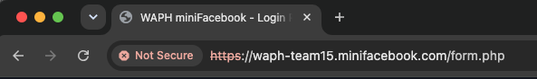

Password must be hashed in database, and no MySQL root account must be used for the PHP code:

Below is a screenshot of the `users` database table. Please note that the passwords are hashed:

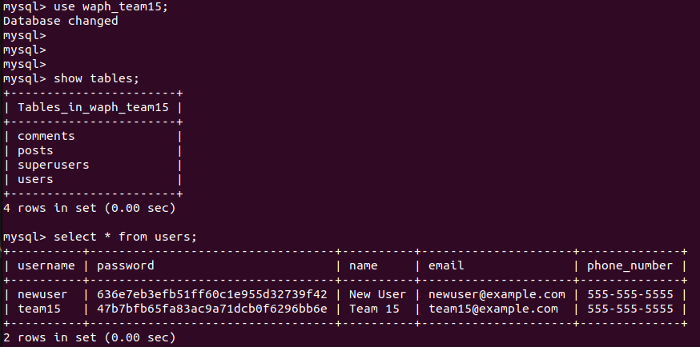

All SQL must be in Prepared Statements

We wrote a file called `database.php` that contains all functions needed to interact with our MySQL database. For each function, we used Prepared Statements. An example is included below to get a user's phone number:

```php
	function get_phone_number($username) {
		$mysqli = login_mysqli();
		$prepared_sql = "SELECT phone_number FROM users WHERE username= ?;";
		$stmt = $mysqli->prepare($prepared_sql);
		$stmt->bind_param("s", $username);
		$stmt->execute();
		$stmt->bind_result($phone_number);

		if ($stmt->fetch()) {
			return $phone_number;
		}
		return null;
	}
```

All inputs must be validated in every layer: HTML, PHP, and SQL.

We used the following function given to us to sanitize both HTML inputs and outputs:

```php
	function sanitize_input($input) {
		$input = trim($input);
		$input = stripslashes($input);
		$input = htmlspecialchars($input);
		return $input;
	}
```

This function trims the input, strips and slashes, and uses HTML special characters to prevent cross site scripting attacks.

HTML outputs must be sanitized

We used the following function given to us to sanitize both HTML inputs and outputs:

```php
	function sanitize_input($input) {
		$input = trim($input);
		$input = stripslashes($input);
		$input = htmlspecialchars($input);
		return $input;
	}
```

This function trims the input, strips and slashes, and uses HTML special characters to prevent cross site scripting attacks.

Integrating an open-source front-end CSS template

We used Pico CSS for the open-source front-end CSS template. Here is a code snippet of how we included it:

```html
<link rel="stylesheet" href="https://cdn.jsdelivr.net/npm/@picocss/pico@2/css/pico.min.css">
```

A team project website

Here is a screenshot of the team project website:

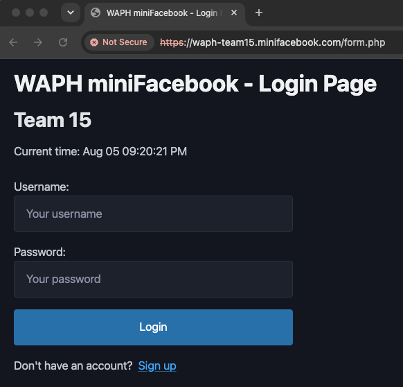

User registration:

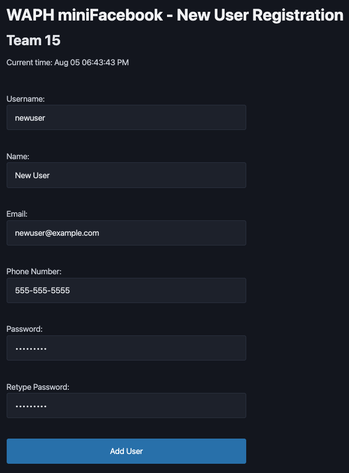

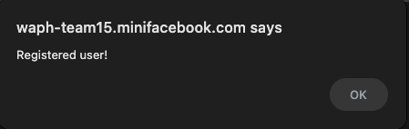

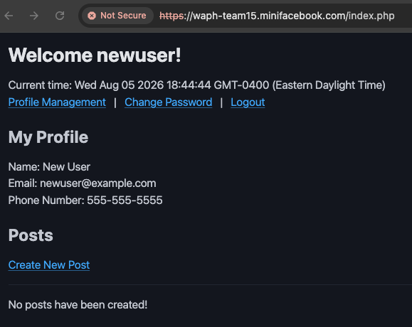

The first screenshot shows a completed registration form for `newuser`. The second screenshot shows that `newuser` was successfully registered. Finally, the third screenshot shows `newuser` successfully logged in. Please note the profile information included in this screenshot is consistent with what was provided in the registration form.

A regular logged-in user can delete their own existing posts but cannot delete the posts of others:

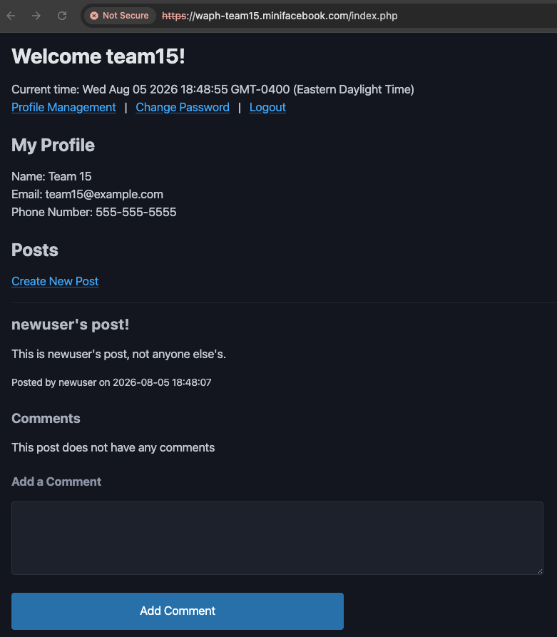

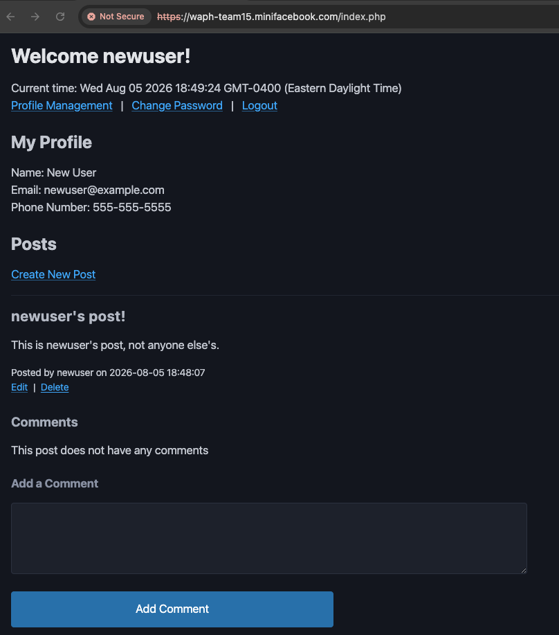

The first screenshot shows the `team15` user logged in. Here, `team15` can see the post that `newuser` created. The second screenshot shows `newuser` logged in. Here, `newuser` can see their own post, along with the `edit` and `delete` links. This shows that only post owners can edit and delete their posts.

CSRF attack to delete a post should be detected and prevented:

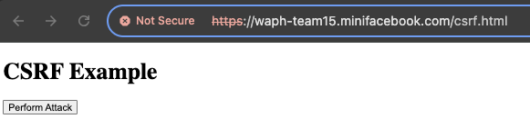

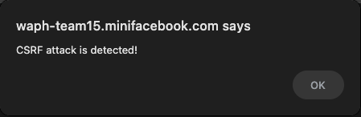

The first screenshot shows that a malicious site that has a hidden form to redirect the logged in user `team15`, to attempt to delete a post with an ID of 1. Upon submission, the CSRF attack is detected by `deletepost.php`, where the user is alerted and logged out. The second screenshot displays this message.

A regular logged-in user cannot access the link for superusers:

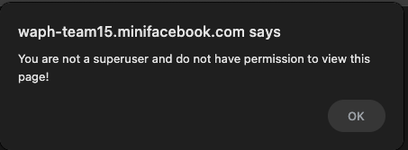

This screenshot shows when a logged in `newuser` attempted to navigate to `https://waph-team15.minifacebook.com/admin/index.php`, where the user does not have the `superuser` role.

**Note:** We did not implement the following:
*   Superuser can disable an account
    *   The disabled account cannot log in 
    *   Superuser can enable the disabled account
    *   The enabled user can log in	
*   A logged-in user can have a real-time chat with other logged-in users

# Software Process Management

## Scrum process

### Sprint 0

Duration: 07/14/2026-07/21/2026

#### Completed Tasks: 

1. Create team SSL key/certificate
2. Set up HTTPS and team local domain name
3. Set up team database
4. Copied and modified login system from Lab 3 with Lab 4 requirements

    a. Screenshot of login system working from team's local HTTPS domain: 
    
    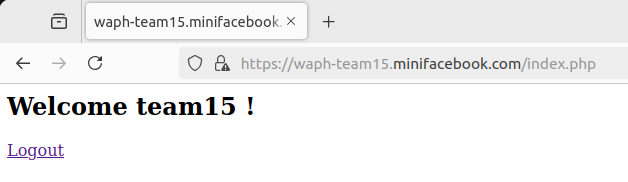

5. Implemented `index.html` page on HTTPS team's local domain

    a. Lucas's Screenshot of the completed task: 
    
    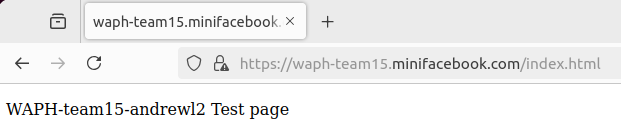

#### Contributions: 

1. Lucas Andrew, 2 commits, 2 hours, contributed in creating team SSL key/certificate, set up HTTPS and team local domain name, copied and modified login system from Lab 3 with Lab 4 requirements to this project
2. Member 2, x commits, y hours, contributed in xxx
3. Member 3, x commits, y hours, contributed in xxx

### Sprint 1

Duration: 07/22/2026-07/28/2026

#### Completed Tasks: 

1. Implemented user registration and login
2. Implemented change password feature
3. Implemented edit profile information feature

#### Contributions: 

1. Lucas Andrew, 1 commits, 2 hours, contributed in implementing tasks 1-3.
2. Member 2, x commits, y hours, contributed in xxx
3. Member 3, x commits, y hours, contributed in xxx

### Sprint 2

Duration: 07/28/2026-08/05/2026

#### Completed Tasks: 

1. Implemented create post feature
2. Implemented edit post feature
3. Implemented delete post feature
4. Implemented add comment feature
5. Implemented superuser login
6. Implemented view all registered users as a superuser

#### Contributions: 

1. Lucas Andrew, 7 commits, 6 hours, contributed in implementing tasks 1-6.
2. Member 2, x commits, y hours, contributed in xxx
3. Member 3, x commits, y hours, contributed in xxx

# Appendix

## profilemanagement.php
```php
<?php
	require "database.php";
    require "session_auth.php";

	$token = $_POST["nocsrftoken"];
	if (!isset($token) || ($token != $_SESSION["nocsrftoken"])) {
		session_destroy();
		echo "<script>alert('CSRF attack is detected!');</script>";
        header("Refresh:0; url=form.php");
		die();
	}

    $username = $_SESSION["username"];
    $name = $_POST["name"];
    $email = $_POST["email"];
	$phone_number = $_POST["phone_number"];

    if (!isset($username) && !isset($name) && !isset($email) && !isset($phone_number)) {
		session_destroy();
		echo "<script>alert('username, name, and email are all required fields!');</script>";
		header("Refresh:0; url=form.php");
		die();
    }

    if (empty($username) || empty($name) || empty($email) || empty($phone_number)) {
		session_destroy();
        echo "<script>alert('username, name, and email cannot be empty!');</script>";
        header("Refresh:0; url=form.php");
		die();
    }

	$username = sanitize_input($username);
	$name = sanitize_input($name);
	$email = sanitize_input($email);
	$phone_number = sanitize_input($phone_number);

	if (preg_match("/^[A-Za-z]+([\s\'.-][A-Za-z]+)*$/", $name) == 0) {
		session_destroy();
		echo "<script>alert('Invalid name!');</script>";
		header("Refresh:0; url=form.php");
		die();
	}

	if (preg_match('/^[\w.-]+@[\w-]+(.[\w-]+)*$/', $email) == 0) {
		session_destroy();
		echo "<script>alert('Invalid email!');</script>";
		header("Refresh:0; url=form.php");
		die();
	}

	if (preg_match('/^\d{3}-\d{3}-\d{4}$/', $phone_number) == 0) {
		session_destroy();
		echo "<script>alert('Invalid phone number!');</script>";
		header("Refresh:0; url=form.php");
		die();
	}

	if (!updateprofile($username, $name, $email, $phone_number)) {
		session_destroy();
        echo "<script>alert('Update profile failed!');</script>";
        header("Refresh:0; url=form.php");
		die();
	} else {
        echo "<script>alert('Profile has been updated!');</script>";
        header("Refresh:0; url=index.php");
	}
?>
```
## form.php
```php
<!DOCTYPE html>
<html lang="en">
  <head>
    <meta charset="utf-8">
    <title>WAPH miniFacebook - Login Page</title>
    <script type="text/javascript">
        function displayTime() {
          const options = {
            month: 'short', // 'Jun'
            day: '2-digit', // '24'
            hour: '2-digit', // '07'
            minute: '2-digit', // '03'
            second: '2-digit', // '45'
            hour12: true // 'am'
          };
          const formattedTime = new Date().toLocaleString('en-US', options).replace(/,/, '');
          document.getElementById('digit-clock').innerHTML = "Current time: " + formattedTime;
        }
        setInterval(displayTime,500);
    </script>
    <link rel="stylesheet" href="https://cdn.jsdelivr.net/npm/@picocss/pico@2/css/pico.min.css">
    <link rel="stylesheet" href="styles.css">
  </head>
  <body>
    <h1>WAPH miniFacebook - Login Page</h1>
    <h2>Team 15</h2>
    <div id="digit-clock"></div>  
  <?php
    $rand = bin2hex(openssl_random_pseudo_bytes(16));
    $_SESSION["nocsrftoken"] = $rand;  
  ?>
    <br>
    <form action="index.php" method="POST" class="form login form-container">
      Username:<input type="text" class="text_field" name="username" required
                      pattern="\w+"
                      placeholder="Your username"
                      title="3-50 characters: letters, numbers, and underscores only">
      Password: <input type="password" class="text_field" name="password" required
                      pattern="^(?=.*[a-z])(?=.*[A-Z])(?=.*[0-9])(?=.*[!@#$%^&])[\w!@#$%^&]{8,}$"
                      placeholder="Your password"
                      title="Password must have at least 8 characters with 1 special symbol !@#$%^& 1 number, 1 lowercase, and 1 UPPERCASE"
                      onchange="this.setCustomValidity(this.validity.patternMismatch?this.title: ''); form.repassword.pattern = this.value;">
      <input type="hidden" name="nocsrftoken" value="<?php echo $rand; ?>"/>
      <button class="button" type="submit">Login</button>
    </form>
    <span>Don't have an account?<a href="registrationform.php">Sign up</a></span>
  </body>
</html>

```
## editpost.php
```php
<?php
    require "database.php";
    require "session_auth.php";

	$token = $_POST["nocsrftoken"];
	if (!isset($token) || ($token != $_SESSION["nocsrftoken"])) {
		session_destroy();
		echo "<script>alert('CSRF attack is detected!');</script>";
        header("Refresh:0; url=form.php");
		die();
	}

    $postID = $_POST["postID"];
    $title = $_POST["title"];
    $content = $_POST["content"];
    $post = get_post($postID);

    if ($post["owner"] != $_SESSION["username"]) {
		session_destroy();
		echo "<script>alert('The non-owner of this post is trying to make an edit!';</script>)";
        header("Refresh:0; url=form.php");
		die();
    }

	if (!isset($postID) && !isset($title) && !isset($content)) {
		session_destroy();
        echo "<script>alert('title and content are required fields!');</script>";
        header("Refresh:0; url=form.php");
		die();
	}

	if (empty($postID) || empty($title) || empty($content)) {
		session_destroy();
        echo "<script>alert('title and content cannot be empty!');</script>";
        header("Refresh:0; url=form.php");
		die();
	}

    $title = sanitize_input($title);
    $content = sanitize_input($content);

	if (!update_post($postID, $title, $content)) {
		session_destroy();
        echo "<script>alert('Update post failed!');</script>";
        header("Refresh:0; url=form.php");
		die();
	} else {
        echo "<script>alert('Post has been updated!');</script>";
        header("Refresh:0; url=index.php");
	}
?>
```
## deletepost.php
```php
<?php
    require "database.php";
    require "session_auth.php";

	$token = $_POST["nocsrftoken"];
	if (!isset($token) || ($token != $_SESSION["nocsrftoken"])) {
		session_destroy();
		echo "<script>alert('CSRF attack is detected!');</script>";
        header("Refresh:0; url=form.php");
		die();
	}

    $postID = $_POST["postID"];
    $post = get_post($postID);

    if ($post["owner"] != $_SESSION["username"]) {
		session_destroy();
		echo "<script>alert('The non-owner of this post is trying to delete it!');</script>";
        header("Refresh:0; url=form.php");
		die();
    }

	if (!isset($postID)) {
		session_destroy();
        echo "<script>alert('title and content are required fields!');</script>";
        header("Refresh:0; url=form.php");
		die();
	}

	if (empty($postID)) {
		session_destroy();
        echo "<script>alert('title and content cannot be empty!');</script>";
        header("Refresh:0; url=form.php");
		die();
	}

	if (!delete_post($postID)) {
		session_destroy();
        echo "<script>alert('Delete post failed!');</script>";
        header("Refresh:0; url=form.php");
		die();
	} else {
        echo "<script>alert('Post has been deleted!');</script>";
        header("Refresh:0; url=index.php");
	}
?>
```
## changepasswordform.php
```php
<?php
    require "session_auth.php";
?>
<!DOCTYPE html>
<html lang="en">
    <head>
        <meta charset="utf-8">
        <title>WAPH miniFacebook - Change Password</title>
        <script type="text/javascript">
            function displayTime() {
                document.getElementById('digit-clock').innerHTML = "Current time: " + new Date();
            }
            setInterval(displayTime, 500);
        </script>
        <link rel="stylesheet" href="https://cdn.jsdelivr.net/npm/@picocss/pico@2/css/pico.min.css">
        <link rel="stylesheet" href="styles.css">
    </head>
    <body>
        <h1>WAPH miniFacebook - Change Password</h1>
        <h2>Team 15</h2>
        <div id="digit-clock"></div>
        <?php
            $rand = bin2hex(openssl_random_pseudo_bytes(16));
            $_SESSION["nocsrftoken"] = $rand;
        ?>
        <br>
        <form action="changepassword.php" method="POST" class="form login form-container">
            New Password: <input type="password" class="text_field" name="newpassword" required
                             pattern="^(?=.*[a-z])(?=.*[A-Z])(?=.*[0-9])(?=.*[!@#$%^&])[\w!@#$%^&]{8,}$"
                             placeholder="New password"
                             title="Password must have at least 8 characters with 1 special symbol !@#$%^& 1 number, 1 lowercase, and 1 UPPERCASE">
            <input type="hidden" name="nocsrftoken" value="<?php echo $rand; ?>"/>
            <button class="button" type="submit">Change password</button>
        </form>
        <a href="index.php">Go back</a>
    </body>
</html>


```
## profilemanagementform.php
```php
<?php
    require "session_auth.php";
?>
<!DOCTYPE html>
<html>
    <head>
        <meta charset="utf-8">
        <title>WAPH miniFacebook - Profile Management</title>
        <script type="text/javascript">
            function displayTime() {
                document.getElementById('digit-clock').innerHTML = "Current time: " + new Date();
            }
            setInterval(displayTime, 500);
        </script>
        <link rel="stylesheet" href="https://cdn.jsdelivr.net/npm/@picocss/pico@2/css/pico.min.css">
        <link rel="stylesheet" href="styles.css">
    </head>
    <body>
        <h1>WAPH miniFacebook - Profile Management</h1>
        <h2>Team 15</h2>
        <div id="digit-clock"></div>
        <?php
            $rand = bin2hex(openssl_random_pseudo_bytes(16));
            $_SESSION["nocsrftoken"] = $rand;        
        ?>
        <br>
        <form action="profilemanagement.php" method="post" class="form-container">
            Username: <?php echo $_SESSION["username"]; ?><br>
            Name:<input type="text" class="text_field" name="name" required
                        pattern="^[A-Za-z]+([\s'.-][A-Za-z]+)*$"
                        placeholder="First and Last name"
                        title="Letters and spaces only">
            Email:<input type="text" class="text_field" name="email" required
                        pattern="^[\w.-]+@[\w-]+(.[\w-]+)*$"
                        placeholder="Your email address"
                        title="Please enter a valid email address">
            Phone Number:<input type="text" class="text_field" name="phone_number" required
                        pattern="^\(?\d{3}\)?[-.\s]?\d{3}[-.\s]?\d{4}$"
                        placeholder="Your phone number"
                        title="Please enter a valid phone number">
            <input type="hidden" name="nocsrftoken" value="<?php echo $rand; ?>"/>
            <button class="button" type="submit">Update Profile</button>
        </form>
        <a href="index.php">Go back</a>
    </body>
</html>


```
## addnewuser.php
```php
<?php
	require "database.php";

	$token = $_POST["nocsrftoken"];
	if (!isset($token) || ($token != $_SESSION["nocsrftoken"])) {
		session_destroy();
		echo "<script>alert('CSRF attack is detected!');</script>";
        header("Refresh:0; url=form.php");
		die();
	}

	$username = $_POST["username"];
	$password = $_POST["password"];
	$repassword = $_POST["repassword"];
	$name = $_POST["name"];
	$email = $_POST["email"];
	$phone_number = $_POST["phone_number"];

	if (!isset($username) && !isset($password) && !isset($repassword) && !isset($name) && !isset($email) && !isset($phone_number)) {
		session_destroy();
		echo "<script>alert('username, password, name, email, and phone number are all required fields!');</script>";
		header("Refresh:0; url=form.php");
		die();
	}

	if (empty($username) || empty($password) || empty($repassword) || empty($name) || empty($email) || empty($phone_number)) {
		session_destroy();
		echo "<script>alert('username, password, name, email, and phone number cannot be empty!');</script>";
		header("Refresh:0; url=form.php");
		die();
	}

	$username = sanitize_input($username);
	$password = sanitize_input($password);
	$repassword = sanitize_input($repassword);
	$name = sanitize_input($name);
	$email = sanitize_input($email);
	$phone_number = sanitize_input($phone_number);

	if (preg_match("/\w+/", $username) == 0) {
		session_destroy();
		echo "<script>alert('Invalid username!');</script>";
		header("Refresh:0; url=form.php");
		die();
	}

	if (preg_match('/^(?=.*[a-z])(?=.*[A-Z])(?=.*[0-9])(?=.*[!@#$%^&])[\w!@#$%^&]{8,}$/', $password) == 0) {
		session_destroy();
		echo "<script>alert('Invalid password!');</script>";
		header("Refresh:0; url=form.php");
		die();
	}

	if (preg_match("/^[A-Za-z]+([\s\'.-][A-Za-z]+)*$/", $name) == 0) {
		session_destroy();
		echo "<script>alert('Invalid name!');</script>";
		header("Refresh:0; url=form.php");
		die();
	}

	if (preg_match('/^[\w.-]+@[\w-]+(.[\w-]+)*$/', $email) == 0) {
		session_destroy();
		echo "<script>alert('Invalid email!');</script>";
		header("Refresh:0; url=form.php");
		die();
	}

	if (preg_match('/^\d{3}-\d{3}-\d{4}$/', $phone_number) == 0) {
		session_destroy();
		echo "<script>alert('Invalid phone number!');</script>";
		header("Refresh:0; url=form.php");
		die();
	}

	if ($password !== $repassword) {
		session_destroy();
		echo "<script>alert('Passwords do not match!');</script>";
		header("Refresh:0; url=form.php");
		die();
	}

	if (!addnewuser($username, $password, $name, $email, $phone_number)) {
		session_destroy();
		echo "<script>alert('Failed to register user');</script>";
		header("Refresh:0; url=form.php");
		die();
	} else {
		echo "<script>alert('Registered user!');</script>";
		header("Refresh:0; url=form.php");
	}
?>

```
## changepassword.php
```php
<?php
	require "database.php";
    require "session_auth.php";

	$token = $_POST["nocsrftoken"];
	if (!isset($token) || ($token != $_SESSION["nocsrftoken"])) {
		session_destroy();
		echo "<script>alert('CSRF attack is detected!');</script>";
        header("Refresh:0; url=form.php");
		die();
	}

    $username = $_SESSION["username"];
	$password = $_POST["newpassword"];

	if (!isset($username) && !isset($password)) {
		session_destroy();
        echo "<script>alert('username and newpassword are required fields!');</script>";
        header("Refresh:0; url=form.php");
		die();
	}

	if (empty($username) || empty($password) ) {
		session_destroy();
        echo "<script>alert('username and password cannot be empty!');</script>";
        header("Refresh:0; url=form.php");
		die();
	}

	$password = sanitize_input($password);

	if (preg_match('/^(?=.*[a-z])(?=.*[A-Z])(?=.*[0-9])(?=.*[!@#$%^&])[\w!@#$%^&]{8,}$/', $password) == 0) {
		session_destroy();
        echo "<script>alert('Invalid password!');</script>";
        header("Refresh:0; url=form.php");
		die();
	}

	if (!changepassword($username, $password)) {
		session_destroy();
        echo "<script>alert('Change password failed!');</script>";
        header("Refresh:0; url=form.php");
		die();
	} else {
        echo "<script>alert('Password has been changed!');</script>";
        header("Refresh:0; url=index.php");
	}

	function changepassword($username, $password) {
		$mysqli = new mysqli('localhost', 'team15', 'password', 'waph_team15');
		if ($mysqli->connect_errno) {
			printf("Database connection failed: %s\n", $mysqli->connect_error);
			return FALSE;
		}
		$prepared_sql = "UPDATE users SET password = md5(?) WHERE username = ?;";
		$stmt = $mysqli->prepare($prepared_sql);
		$stmt->bind_param("ss", $password, $username);
		if ($stmt->execute()) return TRUE;
		return FALSE;
  	}
?>
```
## index.php
```php
<?php
	require "database.php";

	$lifetime = 15 * 60;
	$path = "/";
	$domain = "192.168.56.7";
	$secure = TRUE;
	$httponly = TRUE;
	session_set_cookie_params($lifetime, $path, $domain, $secure, $httponly);
	session_start();

	if (isset($_POST["username"]) and isset($_POST["password"])){
		if (checklogin_mysql($_POST["username"],$_POST["password"])) {
			$_SESSION["authenticated"] = TRUE;
			$_SESSION["username"] = $_POST["username"];
			$_SESSION["browser"] = $_SERVER["HTTP_USER_AGENT"];
		} else {
			session_destroy();
			echo "<script>alert('Invalid username/password');window.location='form.php';</script>";
			die();
		}
	}

	if (!$_SESSION["authenticated"] or $_SESSION["authenticated"] != TRUE) {
		session_destroy();
		echo "<script>alert('You have not login. Please login first');</script>";
		header("Refresh:0; url=form.php");
		die();
	}

	if ($_SESSION["browser"] != $_SERVER["HTTP_USER_AGENT"]) {
		session_destroy();
		echo "<script>alert('Session hijacking is detected!');</script>";
		header("Refresh:0; url=form.php");
		die();
	}

	$name = get_name($_SESSION["username"]);
	$email = get_email($_SESSION["username"]);
	$phone_number = get_phone_number($_SESSION["username"]);
	$posts = get_all_posts();
    $rand = bin2hex(openssl_random_pseudo_bytes(16));
    $_SESSION["nocsrftoken"] = $rand;  
?>
	<head>
        <script type="text/javascript">
            function displayTime() {
                document.getElementById('digit-clock').innerHTML = "Current time: " + new Date();
            }
            setInterval(displayTime, 500);
        </script>
		<link rel="stylesheet" href="https://cdn.jsdelivr.net/npm/@picocss/pico@2/css/pico.min.css">
		<link rel="stylesheet" href="styles.css">
	</head>
	<h2>Welcome <?php echo htmlspecialchars($_SESSION["username"], ENT_QUOTES, 'UTF-8');?>!</h2>
	<div id="digit-clock"></div>
	<a href="profilemanagementform.php">Profile Management</a> |
	<a href="changepasswordform.php">Change Password</a> | 
	<a href="logout.php">Logout</a>
	<br><br>
	<h3>My Profile</h3>
	<span>Name: <?php echo htmlspecialchars($name, ENT_QUOTES, 'UTF-8');?></span><br>
	<span>Email: <?php echo htmlspecialchars($email, ENT_QUOTES, 'UTF-8');?></span><br>
	<span>Phone Number: <?php echo htmlspecialchars($phone_number, ENT_QUOTES, 'UTF-8');?></span><br>
	<br>
	<h3>Posts</h3>
	<?php if (isset($_SESSION["username"])): ?>
		<a href="newpost.php">Create New Post</a>
		<hr>
	<?php endif; ?>
	<?php if (!empty($posts)): ?>
		<?php foreach ($posts as $post): ?>
			<h4><?php echo htmlentities($post["title"]); ?></h4>
			<p><?php echo nl2br(htmlentities($post["content"])); ?></p>
			<small>
				Posted by <?php echo htmlentities($post["owner"]); ?>
				on <?php echo htmlentities($post["date"]); ?>
			</small>
			<br>
			<?php if (isset($_SESSION["username"]) and $_SESSION["username"] == $post["owner"]): ?>
				<small style="padding-left: 0px;">
					<a href="editpostform.php?id=<?php echo $post["postID"]; ?>">Edit</a>|
					<form action="deletepost.php" method="post" style="display: inline-block; padding-left: 5px; margin-block-end: 0;">
						<input type="hidden" name="postID" value="<?php echo $post["postID"];?>">
						<input type="hidden" name="nocsrftoken" value="<?php echo $rand; ?>">
            			<button class="link-button" type="submit">Delete</button>
					</form>
				</small>
			<?php endif; ?>
			<h5>Comments</h5>
			<?php $comments = get_comments($post["postID"]); ?>
			<?php if (!empty($comments)): ?>
				<?php foreach ($comments as $comment): ?>
					<span><?php echo nl2br(htmlentities($comment["content"])); ?></span>
					<br>
					<small>
						Comment by <?php echo htmlentities($comment["owner"]); ?>
						on <?php echo htmlentities($comment["date"]); ?>
					</small>
					<br><br>
				<?php endforeach; ?>
			<?php else: ?>
				<span>This post does not have any comments</span>
				<br>
			<?php endif; ?>
			<?php if (isset($_SESSION["username"])): ?>
				<h6>Add a Comment</h6>
				<form action="addnewcomment.php" method="post" class="form-container">
					<input type="hidden" name="postID" value="<?php echo $post["postID"];?>">
					<textarea name="content" rows="3" cols="50" required></textarea>
					<br>
            		<input type="hidden" name="nocsrftoken" value="<?php echo $rand; ?>">
            		<button class="button" type="submit">Add Comment</button>
				</form>
			<?php endif; ?>
			<hr>
		<?php endforeach; ?>
	<?php else: ?>
		<span>No posts have been created!</span>
	<?php endif; ?>

```
## registrationform.php
```php
<?php
  require "csrf.php";
?>
<!DOCTYPE html>
<html lang="en">
<head>
  <meta charset="utf-8">
  <title>WAPH miniFacebook - New User Registration</title>
  <script type="text/javascript">
      function displayTime() {
        const options = {
          month: 'short', // 'Jun'
          day: '2-digit', // '24'
          hour: '2-digit', // '07'
          minute: '2-digit', // '03'
          second: '2-digit', // '45'
          hour12: true // 'am'
        };
        const formattedTime = new Date().toLocaleString('en-US', options).replace(/,/, '');
        document.getElementById('digit-clock').innerHTML = "Current time: " + formattedTime;
      }
      setInterval(displayTime,500);
  </script>
  <link rel="stylesheet" href="https://cdn.jsdelivr.net/npm/@picocss/pico@2/css/pico.min.css">
  <link rel="stylesheet" href="styles.css">
</head>
<body>
  <h1>WAPH miniFacebook - New User Registration</h1>
  <h2>Team 15</h2>
  <div id="digit-clock"></div>  
<?php
	$lifetime = 15 * 60;
	$path = "/";
	$domain = "192.168.56.7";
	$secure = TRUE;
	$httponly = TRUE;
	session_set_cookie_params($lifetime, $path, $domain, $secure, $httponly);  
  session_start();

  $rand = bin2hex(openssl_random_pseudo_bytes(16));
	$_SESSION["nocsrftoken"] = $rand;
?>
  <br>
  <br>
  <form action="addnewuser.php" method="POST" class="form-container">
    Username:<input type="text" class="text_field" name="username" required
                    pattern="\w+"
                    placeholder="Your username"
                    title="3-50 characters: letters, numbers, and underscores only"><br>
    Name:<input type="text" class="text_field" name="name" required
                pattern="^[A-Za-z]+([\s'.-][A-Za-z]+)*$"
                placeholder="First and Last name"
                title="Letters and spaces only"><br>
    Email:<input type="text" class="text_field" name="email" required
                 pattern="^[\w.-]+@[\w-]+(.[\w-]+)*$"
                 placeholder="Your email address"
                 title="Please enter a valid email address"><br>
    Phone Number:<input type="text" class="text_field" name="phone_number" required
                 pattern="^\(?\d{3}\)?[-.\s]?\d{3}[-.\s]?\d{4}$"
                 placeholder="Your phone number"
                 title="Please enter a valid phone number"><br>
    Password: <input type="password" class="text_field" name="password" required
                     pattern="^(?=.*[a-z])(?=.*[A-Z])(?=.*[0-9])(?=.*[!@#$%^&])[\w!@#$%^&]{8,}$"
                     placeholder="Your password"
                     title="Password must have at least 8 characters with 1 special symbol !@#$%^& 1 number, 1 lowercase, and 1 UPPERCASE"
                     onchange="this.setCustomValidity(this.validity.patternMismatch?this.title: ''); form.repassword.pattern = this.value;"><br>
    Retype Password: <input type="password" class="text_field" name="repassword"
                            placeholder="Retype your password"
                            title="Password does not match"
                            onchange="this.setCustomValidity(this.validity.patternMismatch?this.title: '');"><br>
    <input type="hidden" name="nocsrftoken" value="<?php echo $token; ?>">
    <button class="button" type="submit">Add User</button>
  </form>
</body>
</html>

```
## editpostform.php
```php
<?php
    require "database.php";
    require "session_auth.php";

    $postID = $_GET["id"];
    $post = get_post($postID);

    if ($post["owner"] != $_SESSION["username"]) {
		session_destroy();
		echo "<script>alert('The non-owner of this post is trying to make an edit!';</script>)";
        header("Refresh:0; url=form.php");
		die();
    }
?>
<!DOCTYPE html>
<html>
    <head>
        <meta charset="utf-8">
        <title>WAPH miniFacebook - Edit Post</title>
        <script type="text/javascript">
            function displayTime() {
                document.getElementById('digit-clock').innerHTML = "Current time: " + new Date();
            }
            setInterval(displayTime, 500);
        </script>
        <link rel="stylesheet" href="https://cdn.jsdelivr.net/npm/@picocss/pico@2/css/pico.min.css">
        <link rel="stylesheet" href="styles.css">
    </head>
    <body>
        <h1>WAPH miniFacebook - Edit Post</h1>
        <h2>Team 15</h2>
        <div id="digit-clock"></div>
        <?php
            $rand = bin2hex(openssl_random_pseudo_bytes(16));
            $_SESSION["nocsrftoken"] = $rand;        
        ?>
        <br>
        <form action="editpost.php" method="post" class="form-container">
            <input type="hidden" name="postID" value="<?php echo $post["postID"]; ?>">
            Title
            <input type="text" name="title" value="<?php echo htmlentities($post["title"]); ?>" required>
            Content
            <textarea name="content" rows="8" cols="60" required><?php echo htmlentities($post["content"]); ?></textarea>
            <input type="hidden" name="nocsrftoken" value="<?php echo $rand; ?>"/>
            <button class="button" type="submit">Save Changes</button>
        </form>
    </body>
    <a href="index.php">Go back</a>
</html>
```
## logout.php
```php
<?php
    session_start();
    session_destroy();
?>
<head>
    <link rel="stylesheet" href="https://cdn.jsdelivr.net/npm/@picocss/pico@2/css/pico.min.css">
    <link rel="stylesheet" href="styles.css">
</head>
<p> You are logged out! </p>

<a href="form.php">Login again</a>
```
## newpost.php
```php
<?php
    require "session_auth.php";
?>
<!DOCTYPE html>
<html>
    <head>
        <meta charset="utf-8">
        <title>WAPH miniFacebook - Add New Post</title>
        <script type="text/javascript">
            function displayTime() {
                document.getElementById('digit-clock').innerHTML = "Current time: " + new Date();
            }
            setInterval(displayTime, 500);
        </script>
        <link rel="stylesheet" href="https://cdn.jsdelivr.net/npm/@picocss/pico@2/css/pico.min.css">
        <link rel="stylesheet" href="styles.css">
    </head>
    <body>
        <h1>WAPH miniFacebook - Add New Post</h1>
        <h2>Team 15</h2>
        <div id="digit-clock"></div>
        <?php
            $rand = bin2hex(openssl_random_pseudo_bytes(16));
            $_SESSION["nocsrftoken"] = $rand;        
        ?>
        <br>
        <form action="addnewpost.php" method="post" class="form-container">
            Title
            <input type="text" name="title" required>
            Content
            <textarea name="content" rows="8" cols="60" required></textarea>
            <input type="hidden" name="nocsrftoken" value="<?php echo $rand; ?>"/>
            <button class="button" type="submit">Create Post</button>
        </form>
        <a href="index.php">Go back</a>
    </body>
</html>
```
## addnewcomment.php
```php
<?php
    require "database.php";
    require "session_auth.php";

	$token = $_POST["nocsrftoken"];
	if (!isset($token) || ($token != $_SESSION["nocsrftoken"])) {
		session_destroy();
		echo "<script>alert('CSRF attack is detected!');</script>";
        header("Refresh:0; url=form.php");
		die();
	}

    $postID = $_POST["postID"];
    $content = $_POST["content"];

	if (!isset($postID) && !isset($content)) {
		session_destroy();
        echo "<script>alert('postID and content are required fields!');</script>";
        header("Refresh:0; url=form.php");
		die();
	}

	if (empty($postID) || empty($content) ) {
		session_destroy();
        echo "<script>alert('postID and content cannot be empty!');</script>";
        header("Refresh:0; url=form.php");
		die();
	}

    if (!add_comment($postID, $_SESSION["username"], $content)) {
		session_destroy();
        echo "<script>alert('Adding comment failed!');</script>";
        header("Refresh:0; url=form.php");
		die();
    } else {
        echo "<script>alert('Comment has been added!');</script>";
        header("Refresh:0; url=index.php");
    }
?>
```
## session_auth.php
```php
<?php
	$lifetime = 15 * 60;
	$path = "/";
	$domain = "192.168.56.7";
	$secure = TRUE;
	$httponly = TRUE;
	session_set_cookie_params($lifetime, $path, $domain, $secure, $httponly);
	session_start();    
	if (!$_SESSION["authenticated"] or $_SESSION["authenticated"] != TRUE) {
		session_destroy();
		echo "<script>alert('You have not login. Please login first');</script>";
		header("Refresh:0; url=form.php");
		die();
	}
	if ($_SESSION["browser"] != $_SERVER["HTTP_USER_AGENT"]) {
		session_destroy();
		echo "<script>alert('Session hijacking is detected!');</script>";
		header("Refresh:0; url=form.php");
		die();
	}
?>
```
## addnewpost.php
```php
<?php
    require "database.php";
    require "session_auth.php";

	$token = $_POST["nocsrftoken"];
	if (!isset($token) || ($token != $_SESSION["nocsrftoken"])) {
		session_destroy();
		echo "<script>alert('CSRF attack is detected!');</script>";
        header("Refresh:0; url=form.php");
		die();
	}

    $title = $_POST["title"];
    $content = $_POST["content"];

	if (!isset($title) && !isset($content)) {
		session_destroy();
        echo "<script>alert('title and content are required fields!');</script>";
        header("Refresh:0; url=form.php");
		die();
	}

	if (empty($title) || empty($content) ) {
		session_destroy();
        echo "<script>alert('title and content cannot be empty!');</script>";
        header("Refresh:0; url=form.php");
		die();
	}

	if (!add_post($_SESSION["username"], $title, $content)) {
		session_destroy();
        echo "<script>alert('Add post failed!');</script>";
        header("Refresh:0; url=form.php");
		die();
	} else {
        echo "<script>alert('Post has been added!');</script>";
        header("Refresh:0; url=index.php");
	}
?>

```
## database.php
```php
<?php
    function login_mysqli() {
		$mysqli = new mysqli('localhost', 'team15', 'password', 'waph_team15');
		if ($mysqli->connect_errno) {
			printf("Database connection failed: %s\n", $mysqli->connect_error);
			exit();
		}
        return $mysqli;
    }

	function sanitize_input($input) {
		$input = trim($input);
		$input = stripslashes($input);
		$input = htmlspecialchars($input);
		return $input;
	}

	function checklogin_superuser($username, $password) {
		$mysqli = login_mysqli();
		$prepared_sql = "SELECT * FROM superusers WHERE username= ? " . 
		                                " AND password=md5(?);";
		$stmt = $mysqli->prepare($prepared_sql);
		$stmt->bind_param("ss", $username, $password);
		$stmt->execute();
		$result=$stmt->get_result();
		if ($result->num_rows == 1) return TRUE;
		return FALSE;
	}

    function checklogin_mysql($username, $password) {
		$mysqli = login_mysqli();
		$prepared_sql = "SELECT * FROM users WHERE username= ? " . 
		                                " AND password=md5(?);";
		$stmt = $mysqli->prepare($prepared_sql);
		$stmt->bind_param("ss", $username, $password);
		$stmt->execute();
		$result=$stmt->get_result();
		if ($result->num_rows == 1) return TRUE;
		return FALSE;
  	}

	function get_all_users() {
        $mysqli = login_mysqli();
        $prepared_sql = "SELECT username, name, email, phone_number FROM users;";
        $stmt = $mysqli->prepare($prepared_sql);
        $stmt->execute();
        $stmt->bind_result(
            $username,
            $name,
            $email,
            $phone_number
        );

        $users = [];
        while ($stmt->fetch()) {
            $users[] = [
                "username" => $username,
                "name" => $name,
                "email" => $email,
                "phone_number" => $phone_number
            ];
        }

        return $users;
	}

	function get_name($username) {
		$mysqli = login_mysqli();
		$prepared_sql = "SELECT name FROM users WHERE username= ?;";
		$stmt = $mysqli->prepare($prepared_sql);
		$stmt->bind_param("s", $username);
		$stmt->execute();
		$stmt->bind_result($name);

		if ($stmt->fetch()) {
			return $name;
		}
		return null;
	}

	function get_email($username) {
		$mysqli = login_mysqli();
		$prepared_sql = "SELECT email FROM users WHERE username= ?;";
		$stmt = $mysqli->prepare($prepared_sql);
		$stmt->bind_param("s", $username);
		$stmt->execute();
		$stmt->bind_result($email);

		if ($stmt->fetch()) {
			return $email;
		}
		return null;
	}

	function get_phone_number($username) {
		$mysqli = login_mysqli();
		$prepared_sql = "SELECT phone_number FROM users WHERE username= ?;";
		$stmt = $mysqli->prepare($prepared_sql);
		$stmt->bind_param("s", $username);
		$stmt->execute();
		$stmt->bind_result($phone_number);

		if ($stmt->fetch()) {
			return $phone_number;
		}
		return null;
	}

	function addnewuser($username, $password, $name, $email, $phone_number) {
		$mysqli = login_mysqli();
		$prepared_sql = "INSERT INTO users (username, password, name, email, phone_number) VALUES (?, md5(?), ?, ?, ?);";
		$stmt = $mysqli->prepare($prepared_sql);
		$stmt->bind_param("sssss", $username, $password, $name, $email, $phone_number);

		if ($stmt->execute()) return TRUE;
		return FALSE;
  	}

	function updateprofile($username, $name, $email, $phone_number) {
		$mysqli = login_mysqli();
		$prepared_sql = "UPDATE users SET name = ?, email = ?, phone_number = ? WHERE username = ?;";
		$stmt = $mysqli->prepare($prepared_sql);
		$stmt->bind_param("ssss", $name, $email, $phone_number, $username);

		if ($stmt->execute()) return TRUE;
		return FALSE;
  	}

	function add_post($owner, $title, $content) {
        $mysqli = login_mysqli();
        $prepared_sql = "INSERT INTO posts (owner, title, content) VALUES (?, ?, ?);";
		$stmt = $mysqli->prepare($prepared_sql);
		$stmt->bind_param("sss", $owner, $title, $content);

		if ($stmt->execute()) return TRUE;
		return FALSE;
	}

    function get_all_posts() {
        $mysqli = login_mysqli();
        $prepared_sql = "SELECT postID, title, content, date, owner FROM posts ORDER BY date DESC;";
        $stmt = $mysqli->prepare($prepared_sql);
        $stmt->execute();
        $stmt->bind_result(
            $postID,
            $title,
            $content,
            $date,
            $owner
        );

        $posts = [];
        while ($stmt->fetch()) {
            $posts[] = [
                "postID" => $postID,
                "title" => $title,
                "content" => $content,
                "date" => $date,
                "owner" => $owner
            ];
        }

        return $posts;
    }

    function get_post($postID) {
        $mysqli = login_mysqli();
        $prepared_sql = "SELECT postID, title, content, date, owner FROM posts WHERE postID = ?;";
        $stmt = $mysqli->prepare($prepared_sql);
        $stmt->bind_param("i", $postID);
        $stmt->execute();
        $stmt->bind_result(
            $postID,
            $title,
            $content,
            $date,
            $owner
        );
        $stmt->fetch();
        $post = [
            "postID" => $postID,
            "title" => $title,
            "content" => $content,
            "date" => $date,
            "owner" => $owner
        ];

        return $post;
    }

    function update_post($postID, $title, $content) {
        $mysqli = login_mysqli();
        $prepared_sql = "UPDATE posts SET title=?, content=? WHERE postID=?;";
		$stmt = $mysqli->prepare($prepared_sql);
		$stmt->bind_param("ssi", $title, $content, $postID);

		if ($stmt->execute()) return TRUE;
		return FALSE;
    }

    function delete_post($postID) {
        $mysqli = login_mysqli();
        $prepared_sql = "DELETE FROM posts WHERE postID = ?;";
        $stmt = $mysqli->prepare($prepared_sql);
        $stmt->bind_param("i", $postID);

		if ($stmt->execute()) return TRUE;
		return FALSE;
    }

	function add_comment($postID, $owner, $content) {
		$mysqli = login_mysqli();
		$prepared_sql = "INSERT INTO comments (postID, owner, content) VALUES (?, ?, ?);";
		$stmt = $mysqli->prepare($prepared_sql);
		$stmt->bind_param("iss", $postID, $owner, $content);

		if ($stmt->execute()) return TRUE;
		return FALSE;
	}

	function get_comments($postID) {
		$mysqli = login_mysqli();
		$prepared_sql = "SELECT commentID, owner, content, date FROM comments WHERE postID = ? ORDER BY date ASC;";
		$stmt = $mysqli->prepare($prepared_sql);
		$stmt->bind_param("i", $postID);
		$stmt->execute();
		$stmt->bind_result(
			$commentID,
			$owner,
			$content,
			$date
		);

		$comments = [];
        while ($stmt->fetch()) {
            $comments[] = [
                "commentID" => $commentID,
                "owner" => $owner,
                "content" => $content,
                "date" => $date
            ];
        }

        return $comments;
	}
?>
```
## admin/loginform.php
```php
<!DOCTYPE html>
<html lang="en">
  <head>
    <meta charset="utf-8">
    <title>WAPH miniFacebook - Login Page</title>
    <script type="text/javascript">
        function displayTime() {
          const options = {
            month: 'short', // 'Jun'
            day: '2-digit', // '24'
            hour: '2-digit', // '07'
            minute: '2-digit', // '03'
            second: '2-digit', // '45'
            hour12: true // 'am'
          };
          const formattedTime = new Date().toLocaleString('en-US', options).replace(/,/, '');
          document.getElementById('digit-clock').innerHTML = "Current time: " + formattedTime;
        }
        setInterval(displayTime,500);
    </script>
    <link rel="stylesheet" href="https://cdn.jsdelivr.net/npm/@picocss/pico@2/css/pico.min.css">
    <link rel="stylesheet" href="../styles.css">
  </head>
  <body>
    <h1>WAPH miniFacebook - Superuser Login Page</h1>
    <h2>Team 15</h2>
    <div id="digit-clock"></div>  
  <?php
    $rand = bin2hex(openssl_random_pseudo_bytes(16));
    $_SESSION["nocsrftoken"] = $rand;  
  ?>
    <br>
    <form action="login.php" method="POST" class="form login form-container">
      Username:<input type="text" class="text_field" name="username" required
                      pattern="\w+"
                      placeholder="Your username"
                      title="3-50 characters: letters, numbers, and underscores only">
      Password: <input type="password" class="text_field" name="password" required
                      pattern="^(?=.*[a-z])(?=.*[A-Z])(?=.*[0-9])(?=.*[!@#$%^&])[\w!@#$%^&]{8,}$"
                      placeholder="Your password"
                      title="Password must have at least 8 characters with 1 special symbol !@#$%^& 1 number, 1 lowercase, and 1 UPPERCASE"
                      onchange="this.setCustomValidity(this.validity.patternMismatch?this.title: ''); form.repassword.pattern = this.value;">
      <input type="hidden" name="nocsrftoken" value="<?php echo $rand; ?>"/>
      <button class="button" type="submit">Login</button>
    </form>
  </body>
</html>
```
## admin/login.php
```php
<?php
    require $_SERVER["DOCUMENT_ROOT"] . "/database.php";

    session_start();

	if (isset($_POST["username"]) and isset($_POST["password"])){
		if (checklogin_superuser($_POST["username"],$_POST["password"])) {
			$_SESSION["authenticated"] = TRUE;
			$_SESSION["username"] = $_POST["username"];
			$_SESSION["browser"] = $_SERVER["HTTP_USER_AGENT"];
            $_SESSION["role"] = "superuser";
		} else {
			session_destroy();
			echo "<script>alert('Invalid super username/password');window.location='loginform.php';</script>";
			die();
		}
	}

	if (!$_SESSION["authenticated"] or $_SESSION["authenticated"] != TRUE) {
		session_destroy();
		echo "<script>alert('You have not login. Please login first');</script>";
		header("Refresh:0; url=loginform.php");
		die();
	}

	if ($_SESSION["browser"] != $_SERVER["HTTP_USER_AGENT"]) {
		session_destroy();
		echo "<script>alert('Session hijacking is detected!');</script>";
		header("Refresh:0; url=loginform.php");
		die();
	}

    header("Refresh:0; url=index.php");
?>
```
## admin/index.php
```php
<?php
	require $_SERVER["DOCUMENT_ROOT"] . "/database.php";
    require $_SERVER["DOCUMENT_ROOT"] . "/session_auth.php";

	$lifetime = 15 * 60;
	$path = "/";
	$domain = "192.168.56.7";
	$secure = TRUE;
	$httponly = TRUE;
	session_set_cookie_params($lifetime, $path, $domain, $secure, $httponly);
	session_start();

    if (!isset($_SESSION["role"]) or $_SESSION["role"] != "superuser") {
		session_destroy();
		echo "<script>alert('You are not a superuser and do not have permission to view this page!');</script>";
		header("Refresh:0; url=loginform.php");
		die();
    }

    $users = get_all_users();
?>
	<head>
        <script type="text/javascript">
            function displayTime() {
                document.getElementById('digit-clock').innerHTML = "Current time: " + new Date();
            }
            setInterval(displayTime, 500);
        </script>
		<link rel="stylesheet" href="https://cdn.jsdelivr.net/npm/@picocss/pico@2/css/pico.min.css">
		<link rel="stylesheet" href="../styles.css">
	</head>
	<h2>Welcome <?php echo htmlspecialchars($_SESSION["username"], ENT_QUOTES, 'UTF-8');?>!</h2>
	<div id="digit-clock"></div>
	<a href="logout.php">Logout</a>
	<br><br>
    <h3>Registered Users</h3>
    <table>
        <tr>
            <th><b style="padding-left: 0px;">Username</b></th>
            <th><b style="padding-left: 0px;">Name</b></th>
            <th><b style="padding-left: 0px;">Email</b></th>
            <th><b style="padding-left: 0px;">Phone Number</b></th>
        </tr>
        <?php foreach ($users as $user): ?>
            <tr>
                <td><?php echo htmlentities($user["username"]); ?></td>
                <td><?php echo htmlentities($user["name"]); ?></td>
                <td><?php echo htmlentities($user["email"]); ?></td>
                <td><?php echo htmlentities($user["phone_number"]); ?></td>
            </tr>
        <?php endforeach; ?>
    </table>
```
## admin/logout.php
```php
<?php
    session_start();
    session_destroy();
?>
<head>
    <link rel="stylesheet" href="https://cdn.jsdelivr.net/npm/@picocss/pico@2/css/pico.min.css">
    <link rel="stylesheet" href="../styles.css">
</head>
<p> You are logged out! </p>

<a href="loginform.php">Login again</a>
```
